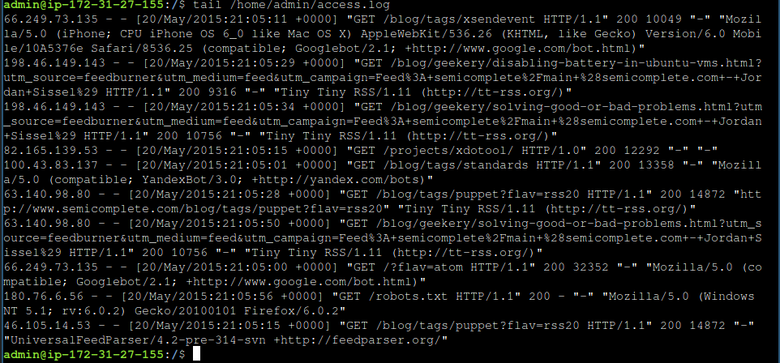
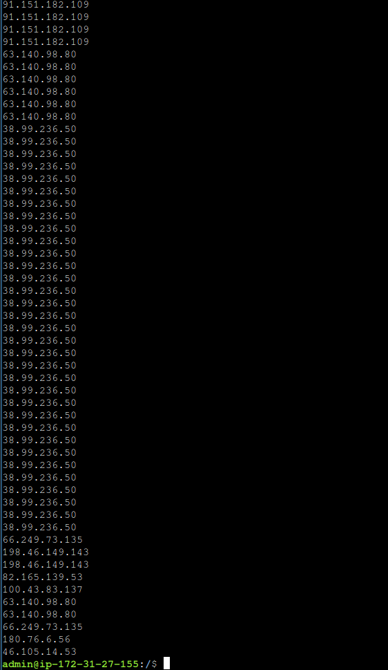
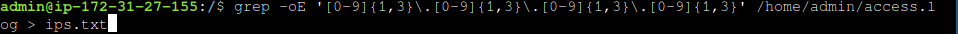
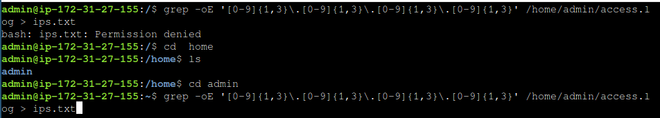

## Description

There's a web server access log file at `/home/admin/access.log`. The file consists of one line per HTTP request, with the requester's IP address at the beginning of each line. You can find the website for this server [here](https://sadservers.com/).This program is no longer needed. Find it and terminate it.

### Step 1: View the Log File

I'll start off by running the `tail` command to see the last few lines of the file and understand what we're dealing with here.



As we can see, that's pretty hectic, and manually going through all of that would just be a waste of time. To resolve this issue, we can use regex expressions to gather all the IP addresses without all the extra data.

 

### Step 2: Output IP Addresses to a Text File

Now this is a lot better; however, we would still have to manually count each and every IP address. Therefore, we will output the text to a text file and sort it out later.



Notice in this command we are re-running the previous command, except we are adding `> ips.txt`, which will output all of the data into our text file `ips.txt`. However, because of the default directory that we are placed in, we don't have write access, so we will need to migrate to our home directory or `/tmp`.



### Step 3: Sort and Count IP Addresses

Now that all the necessary data is in the proper place, we will use these commands to sort it out and place a number beside each IP address to represent how many duplicates there are of it.


#### Explanation:

- `sort ips.txt`: This sorts the IP addresses in `ips.txt`. Sorting is necessary because `uniq` only counts consecutive duplicate lines.
- `uniq -c`: This counts the number of occurrences of each unique line (IP address) and prefixes the count to the output.

The output will look something like this:

```
5 192.168.1.1
```

```
3 10.0.0.5
```

```
458 172.16.0.10
```

In this output:

- The first column shows the count of occurrences.
- The second column shows the corresponding IP address.

### Step 4: Find the Highest IP Address

We can now look for the line with the biggest number and put it in the `highestip.txt` to complete the challenge.


